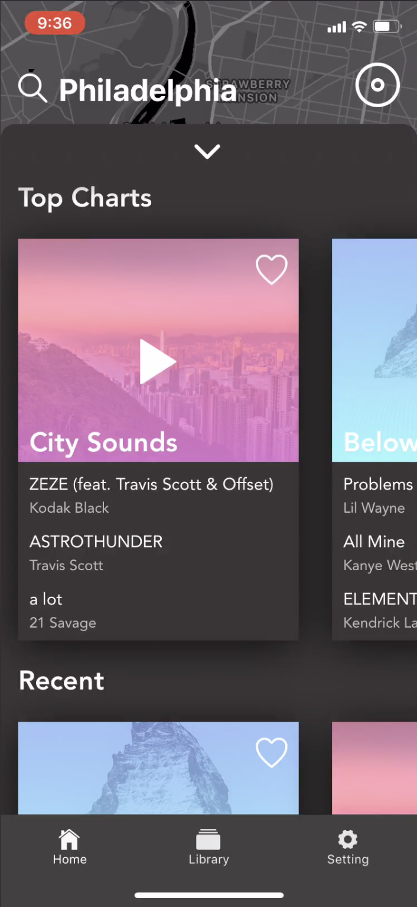
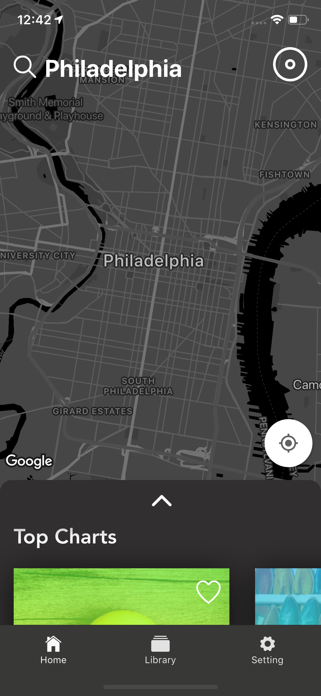
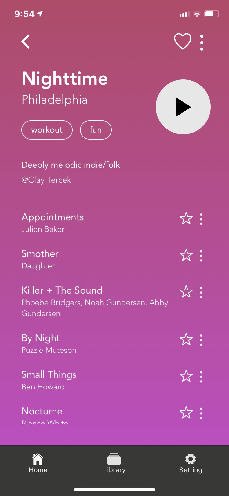
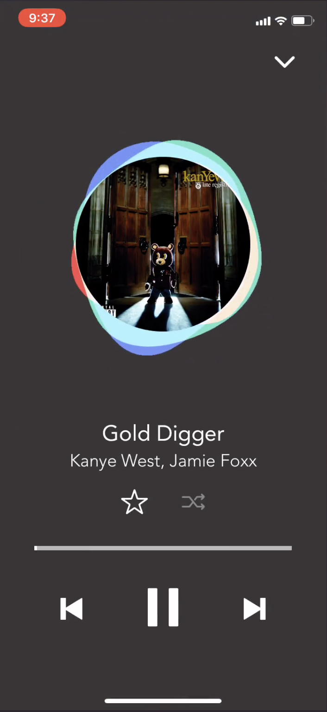

## Resonate is a mobile app built off of the spotify api that allows people to explore any location's local music taste, and helps find the perfect playlist to fit the mood.

**Awards:** [Muse Rose Gold](https://museaward.com/winner-info.php?id=2275), GDUSA American Web Design Award

Users can browse the map and find playlists created and pinned to various locations. The Playlists are user moderated, so popular playlists that truly represent a given location will gain more "hearts" and bubble to the top of the list. 

In addition to filtering playlists based on the users location, the user also has the ability to further filter by mood and additional associated tags. A user can select a specific mood range on the moodpicker, or infer a playlist's mood based on its color.

