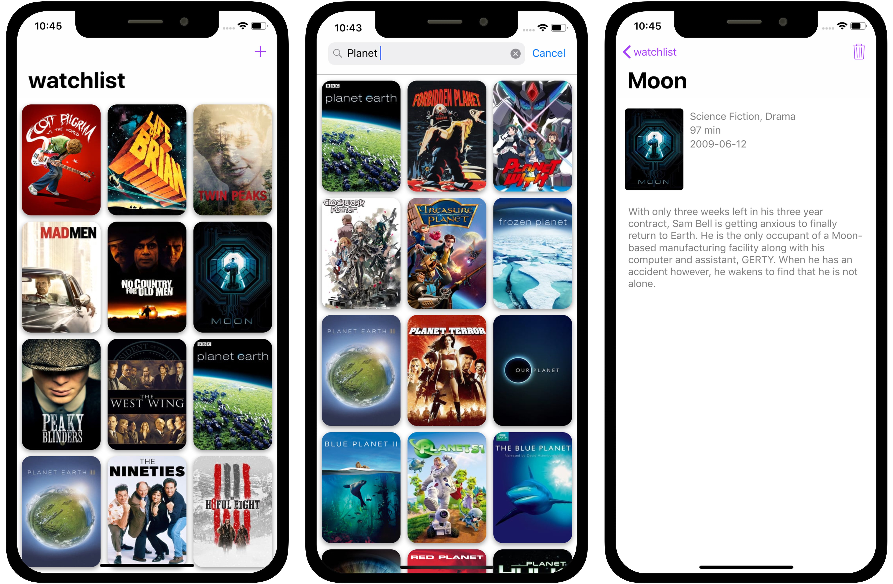

## Watchlist is an iOS app allowing users to keep track of the movies and tv shows that they are interested in watching, with a sleek and intuitive UI.

[view code](https://github.com/claytercek/watchlist)
[view case study](/journal/watchlist)

